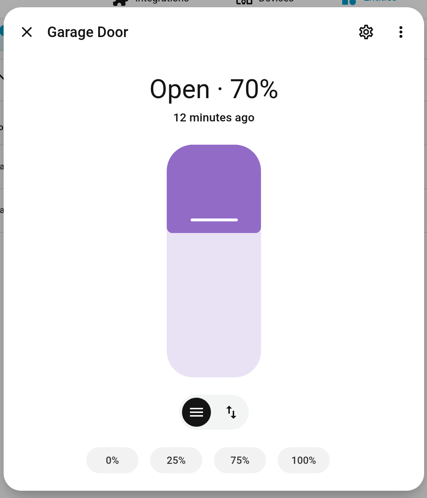
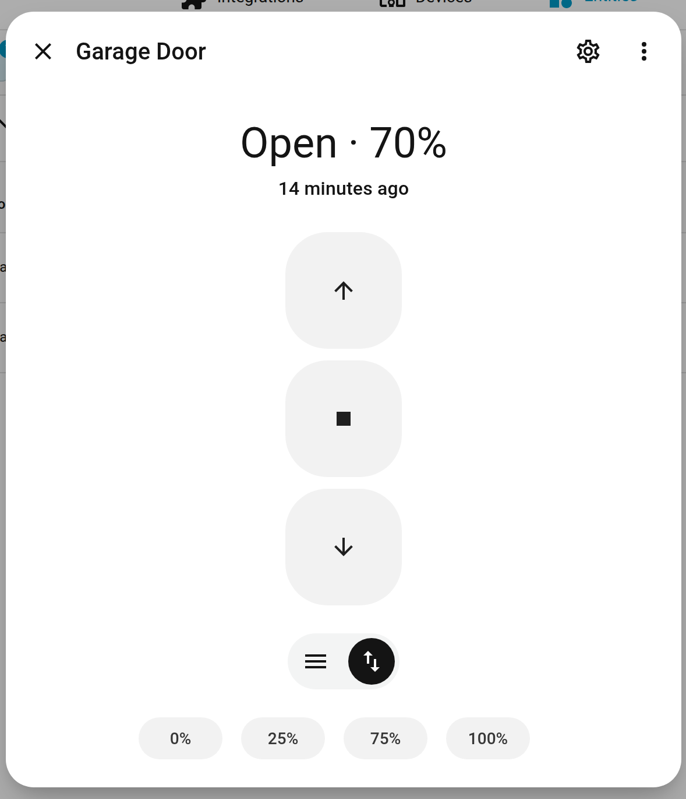
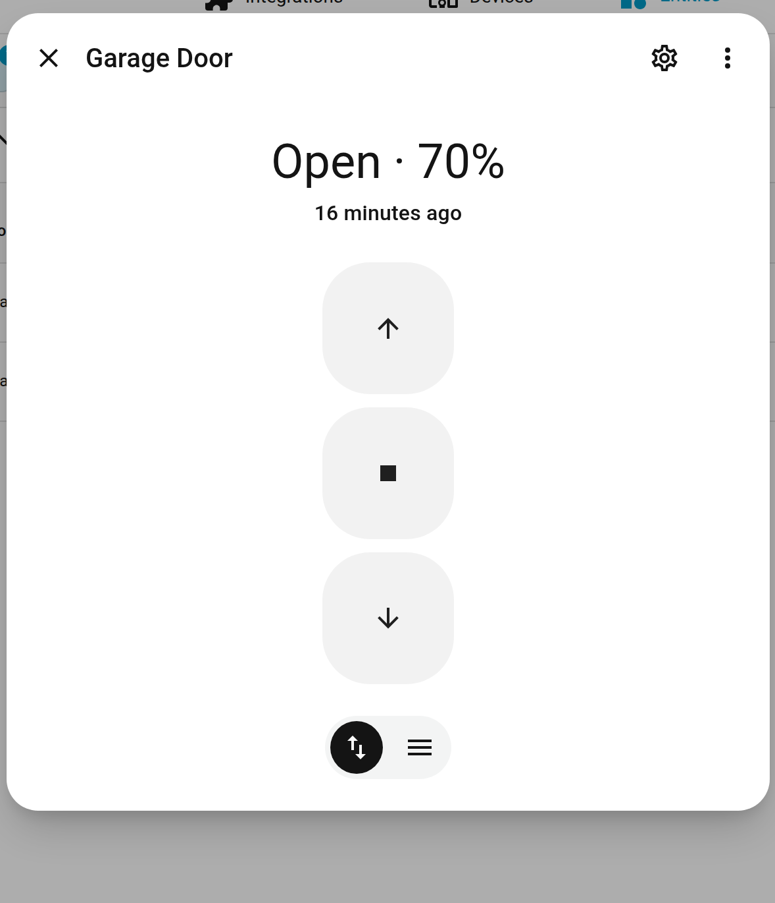
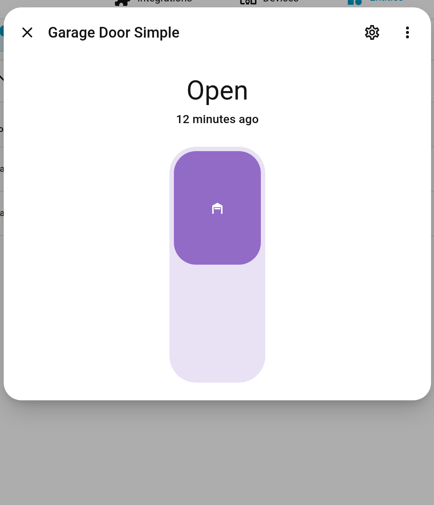

# Garage door more-info dialog: buttons first

## Problem

For a garage door opener that reports position support (`CoverEntityFeature.SET_POSITION`),
the more-info dialog defaults to a **position slider**:

| Current default | Second "tab" (one tap away) |
| --- | --- |
|  |  |

Three problems with this for garage doors (and gates/discrete doors):

1. **Tapping the slider sets a position.** A stray tap partially opens the door to
   that point. For a garage door that's not a harmless mistake — it's a door left
   ajar. Sliders are great when the *target value* is the point (blinds at 40%);
   they're wrong when the device is operated as open/stop/close.
2. **The buttons view is hidden behind an unlabeled toggle**, and the choice
   resets every time the dialog opens — the frontend recomputes the default mode
   on each open, so you can never make the buttons "stick".
3. **Percentage chips (0% / 25% / 75% / 100%) at the bottom** are the default
   "favorite positions" that the frontend shows for any position-capable cover.
   They double down on the percentage mental model, which doesn't match how
   anyone thinks about a garage door.

## Where this lives

None of this UI is in `home-assistant/core` — the dialog is
`src/dialogs/more-info/controls/more-info-cover.ts` in
[`home-assistant/frontend`](https://github.com/home-assistant/frontend). The
shipped bundle (`home-assistant-frontend==20260624.3`) contains the logic:

```js
// willUpdate, minified names expanded
if (!this._mode || entityId !== oldEntityId) {
  this._mode = supportsCoverPosition(this.stateObj) ? "position" : "button";
}
```

The default is chosen purely by capability — device class is never consulted.
That's why a position-capable garage door gets the slider while a plain
open/close garage door gets buttons.

## Proposal

**Make the default mode device-class aware.** For discrete device classes —
`garage`, `gate`, `door` — default to the buttons view and list the buttons
toggle first. Keep the slider available exactly as today, one tap away.

| Proposed default (tested live) | Full proposal (chips hidden too) |
| --- | --- |
|  |  |

The change was verified end-to-end on a local Home Assistant instance: the
shipped bundle was patched with the one-line condition below, and a
position-capable `device_class: garage` template cover then opened directly in
buttons mode (screenshot on the left is the real patched frontend, not a mockup).

### Change 1 — device-class-aware default (the core fix)

```ts
const DISCRETE_DEVICE_CLASSES = [
  CoverDeviceClass.DOOR,
  CoverDeviceClass.GARAGE,
  CoverDeviceClass.GATE,
];

// willUpdate()
if (!this._mode || entityId !== oldEntityId) {
  const discrete = DISCRETE_DEVICE_CLASSES.includes(
    this.stateObj.attributes.device_class as CoverDeviceClass
  );
  this._mode =
    !discrete && supportsCoverPosition(this.stateObj)
      ? "position"
      : "button";
}
```

### Change 2 — toggle order follows the default

In `render()`, emit the button-mode `ha-icon-button-toggle` before the
position-mode one for discrete device classes, so the selected control is also
the first in the group. (Mocked in the right-hand screenshot above.)

### Change 3 — don't show *default* favorite-position chips for discrete classes

`ha-more-info-cover-favorite-positions` falls back to a built-in default set
(0/25/75/100%) when the user hasn't configured favorites. Suppress the
*default* set for `garage`/`gate`/`door`; keep chips the user explicitly
configured (someone who vents their garage 20% for the cat has opted into
percentages deliberately).

## Design notes and alternatives considered

- **Why not remove the slider for garage doors entirely?** Partial opening is a
  real use case (ventilation, pets, tall cargo). The capability is real; it just
  shouldn't be the *first* thing your thumb lands on. Demoting beats deleting.
- **Why device class, not a per-user setting?** The mismatch isn't a
  preference — it's the device's interaction model. A garage remote is a
  button, not a dial. Blinds/shades keep the slider default untouched.
  A settings toggle would fix one dialog for one user; the default fixes it
  for everyone.
- **Remember the last-used mode per entity** (e.g. in `localStorage`) was
  considered as an alternative or complement. It helps, but the *first*
  experience is still wrong, and silent per-device memory is harder to reason
  about than a predictable default. Worth doing *in addition* if the frontend
  team is open to it.
- **Single big toggle instead of up/stop/down?** That's what covers without
  position support already get (see below) — but it loses the STOP action,
  which matters for garage doors. The three-button column keeps stop.
- **Keep "Open · 70%" in the header.** The percentage as *status* is honest and
  useful (the door IS 70% open); it's percentage as *control* that misleads.
  The proposal removes the percentage controls, not the information.

Reference — a garage door *without* position support today (what the proposal
converges towards, while keeping position access one tap away):



## How this was reproduced/tested locally

- `template` cover with `device_class: garage`, `position` +
  `set_cover_position` (mirrors a ratgdo/Konnected-style opener), plus a
  position-less twin for comparison — see [`local-test/configuration.yaml`](local-test/configuration.yaml).
- Frontend package `home-assistant-frontend==20260624.3` served by this
  checkout of core; screenshots via Playwright/Chromium at 1280×900.
- Change 1 was applied to the shipped bundle
  (`hass_frontend/frontend_latest/49887.*.js`) and verified live; changes 2–3
  are DOM mockups of the same dialog.

## Where the real PR goes

This needs a PR against `home-assistant/frontend`
(`src/dialogs/more-info/controls/more-info-cover.ts` and
`.../components/covers/ha-more-info-cover-favorite-positions.ts`), not core.
This repository/branch only hosts the proposal so it can be reviewed; nothing
under `docs/garage-door-ui-redesign/` or `local-test/` is intended to merge
upstream.
